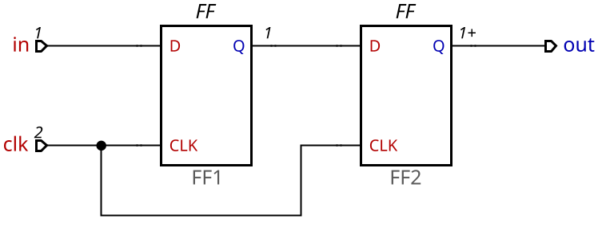

# bit_sync

## Description

The `bit_sync` directory contains digital design implementations focused on bit signal synchronization. This project is particularly useful in systems that require signal integrity and stability across different clock domains.

## Objective

The main goal of this project is to provide efficient solutions for bit synchronization, addressing challenges such as:

- **Metastability**: Minimizing the risk of indeterminate states in flip-flops.
- **Cross-domain signaling**: Facilitating communication between different clock domains.
- **Latency reduction**: Optimizing the propagation time of synchronized signals.

## Directory Structure

The `bit_sync` directory contains the following files and subdirectories:

- `sync.v`: Main implementation of the bit synchronizer.
- `sync_tb.v`: Testbench for validating the functionality of the synchronizer.
- `README.md`: This file, providing an overview of the project.

## How to Use

To use the bit synchronizer in your project:

1. **Module Inclusion**: Include the `sync.v` file in your Verilog project.
2. **Instantiation**: Instantiate the `sync` module in your code, connecting inputs and outputs as needed.
3. **Simulation**: Use the `sync_tb.v` testbench to verify the synchronizer’s behavior in different scenarios.

## Simulation

To simulate the design:

1. Use tools like ModelSim or Vivado to compile and simulate the Verilog files.
2. Run the simulation of `sync_tb.v` to observe the synchronizer’s behavior.
3. Analyze the generated waveforms to verify correct signal synchronization.

## Contributions

Contributions are welcome! To contribute:

1. Fork this repository.
2. Create a branch for your feature (`git checkout -b feature/new-feature`).
3. Commit your changes (`git commit -am 'Add new feature'`).
4. Push to the branch (`git push origin feature/new-feature`).
5. Open a Pull Request.

## License

This project is licensed under the MIT License – see the [LICENSE](LICENSE) file for details.
